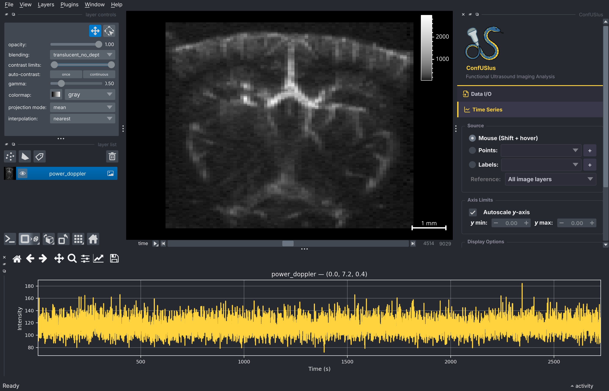
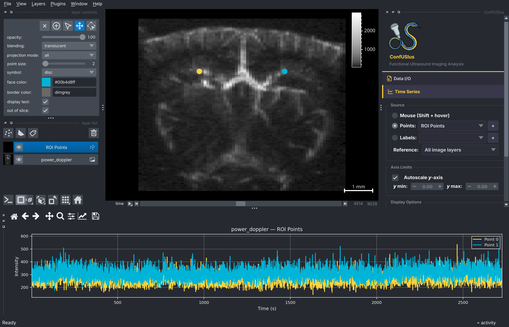
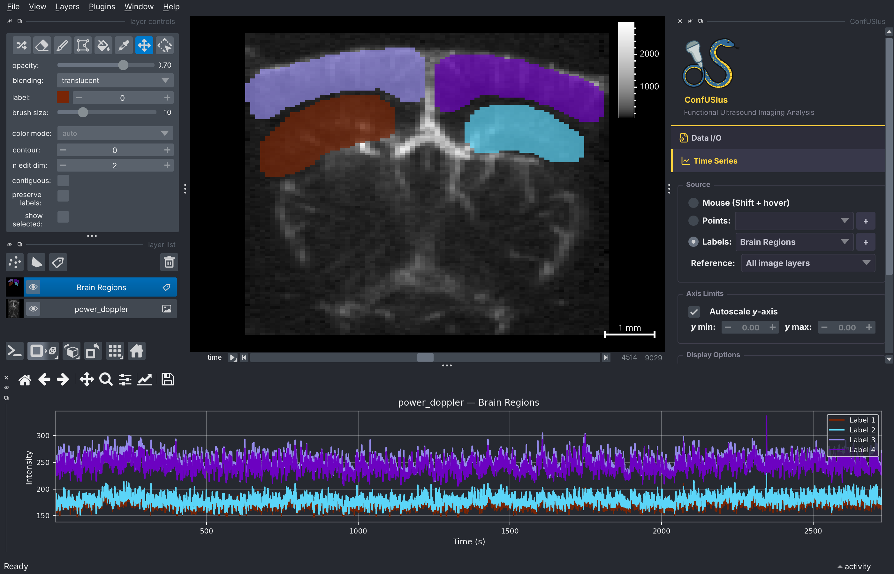

# Using the Plugin

The ConfUSIus sidebar contains three collapsible panels. Each panel operates
independently and can be expanded or collapsed by clicking its header.

## Data I/O Panel

The Data I/O Panel handles both loading and saving fUSI files without leaving the
viewer.

### Loading data

Click **Browse** to pick a file—it loads immediately on selection. Or paste a path
directly in the text field and press ++enter++. Enable **Load lazily** beforehand to
keep the array Dask-backed for large files. A progress bar animates during loading, and
any error is reported in the napari notification bar.

### Saving data

1. Select the layer to save from the **Save layer** dropdown.
2. Optionally select a layer in the **Coordinates from** dropdown to borrow its physical
   coordinates and attributes. This is useful when saving a labels layer drawn on top of
   a fUSI image: selecting the image layer as the template preserves the full physical
   coordinate system. If the labels layer has fewer dimensions than the template (e.g. a
   3D labels layer against a 4D image), the trailing spatial dimensions are used
   automatically.
3. Type an output path or click **Browse**. The format is inferred from the extension:
   `.nii` / `.nii.gz` for NIfTI and `.zarr` for Zarr.
4. Click **Save**. A notification confirms success.

Three save modes are applied automatically depending on what is available:

| Mode | When applied |
|------|-------------|
| **Direct** | The layer was loaded via ConfUSIus (DataArray in metadata). Saved verbatim, all coordinates and attributes preserved. |
| **Template** | A template layer is selected. Coordinates are borrowed from the template DataArray. |
| **Reconstruct** | No template and no DataArray in metadata (e.g. a freshly drawn labels layer). Coordinates are reconstructed from the napari layer state (`scale`, `translate`, `axis_labels`). |

## Time Series Panel

The Time Series Panel plots the fUSI signal over time for one or more spatial locations.
The plot appears in a bottom dock that is created the first time you use the panel. A
vertical cursor line that follows the napari time slider can optionally be enabled.

### Choosing a data source

Select an image layer from the **Layer** dropdown, then choose one of three source
modes:

**Hover** (default)
: Hold ++shift++ and move the mouse over the canvas. The plot updates live with the time
  series at the cursor position, extracted from the currently selected image layer.

**Points**
: Select a Points layer (or click **New points layer** to create one). Each point is
  plotted as a separate line colored by its face color. Add or remove points in napari
  and the plot updates automatically.

**Labels**
: Select a Labels layer (or click **New labels layer** to create one). The mean time
  series is extracted for each distinct integer label and plotted as a separate line,
  colored by the label's color in the napari colormap. This is useful for quickly
  comparing region-averaged signals after painting ROIs with napari's brush tool.

### Plot options

| Option | Description |
|--------|-------------|
| **Y-axis limits** | Toggle between autoscale and manual min/max. |
| **Z-score** | Normalize each time series to zero mean and unit variance before plotting. |
| **Grid** | Show or hide the background grid. |
| **Reference image** | In Points and Labels modes, select which image layer to extract time series from. Defaults to all image layers, plotting each as a separate line. |

## QC Panel

The QC Panel computes quality control metrics for a selected image layer.

Select a layer from the **Layer** dropdown, check the metrics you want, and click
**Compute**.

=== "Temporal metrics"

    Temporal metrics are rendered as plots in the bottom dock (the same dock used by the
    Time Series Panel, in separate tabs). Computed plots are cached and survive dock
    closure: closing and reopening the bottom dock restores the last computed result.

    **DVARS**
    : Plots the standardized temporal derivative of variance over time. A vertical cursor
      follows the napari time slider. See [DVARS](../user-guide/quality-control.md#dvars)
      for interpretation.

    **Carpet plot**
    : Displays the full voxel time series as a 2D raster (time × voxels). See [Carpet
      Plot](../user-guide/quality-control.md#carpet-plot) for interpretation.

=== "Spatial metrics"

    Spatial map metrics are added as new image layers in the napari layer list, with
    correct physical scale and origin preserved.

    **CV**
    : Coefficient of variation map.

    **tSNR**
    : Temporal signal-to-noise ratio map.

    !!! warning "Prefer CV over tSNR for fUSI power Doppler data"
        tSNR is misleading for power Doppler: low-signal regions such as gel layers and
        shadow zones behind the skull can appear bright. CV correctly highlights regions
        with high temporal variability. See the [Quality Control
        guide](../user-guide/quality-control.md#temporal-snr) for a full explanation.
