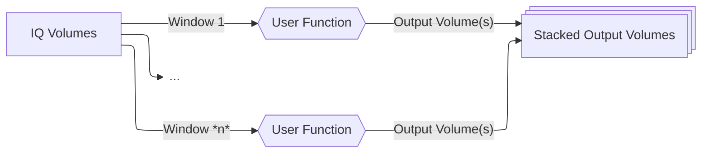
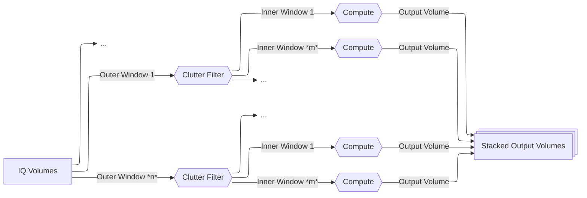

# Processing Beamformed IQ Data

## Introduction

After [loading your beamformed IQ data](io.md#loading-data), the next step in most fUSI
workflows is processing it to extract hemodynamic signals. This guide explains how to
use ConfUSIus to transform beamformed IQ data into measures like power Doppler and
axial velocity.

## Why Process IQ Data?

Beamformed IQ data contains signals from all moving and stationary structures in the
imaging field:

- **Tissue signals**: Strong echoes from slow-moving tissue (~40-60 dB stronger than
  blood).
- **Blood signals**: Weak echoes from fast-moving red blood cells.

Beamformed IQ signals can be processed to extract different types of information
depending on your application:

- **Hemodynamic measures** (fUSI): separate blood from tissue to quantify cerebral blood
  volume changes.
- **Structural imaging** (B-mode): use amplitude information to visualize tissue
  anatomy.
- **Tissue motion**: track tissue displacement (e.g., cardiac pulsatility, respiration).
- **Flow velocimetry**: estimate blood flow speed and direction

This guide covers the **IQ processing functions in ConfUSIus**, which focus primarily on
extracting blood volume information for fUSI applications. The typical workflow
involves:

1. **Filtering** to isolate signals of interest (e.g., blood).
2. **Computing derived measures** from the filtered IQ signals (e.g., power Doppler,
   velocity).

For fUSI specifically, this means using clutter filtering to separate blood from tissue,
then computing measures like power Doppler or axial velocity. The result is a series of
volumes showing changes in cerebral blood volume or flow.

## Understanding Your IQ Data

Before processing, it's important to understand what beamformed IQ data represents and
how it's structured.

### Quick Primer on Beamformed IQ Signals

Most fUSI users work with beamformed IQ signals rather than raw radio-frequency (RF)
signals. Indeed, ultrasound systems emit pulses at high frequencies (typically 1–30
MHz). The received echoes oscillate at these same high frequencies. However, for imaging
we only care about:

- **Amplitude**: how strong is the reflection (related to tissue properties)?
- **Phase**: How much has the phase shifted (related to motion via Doppler effect)?

IQ demodulation extracts this amplitude and phase information while discarding the
high-frequency carrier, allowing for a significant reduction in sampling rate and thus
drastically reducing data volume. A beamformed IQ sample can be represented as

$$
\text{IQ}(x, y, z, k) = A(x, y, z, k) \, e^{j\phi(x, y, z, k)},
$$

where $A$ is amplitude, $\phi$ is phase, $(x, y, z)$ are spatial coordinates, and $k$ is
the **slow-time** index.

!!! info "Slow time vs. fast time"
    - **Fast time**: RF signals sampled at MHz rates.
    - **Slow time**: Beamformed IQ signals sampled once per pulse, at kHz rates.

For single plane-wave imaging, the sampling rate of the beamformed IQ signals equals the
pulse repetition frequency (PRF), typically kHz rates. With **compound imaging** (common
in fUSI), multiple plane waves are emitted at different angles and their echoes are
combined to form a single compound volume[^montaldo2009]. In this case, the effective
sampling rate, the **compound frequency**, is the PRF divided by the number of angles,
typically hundreds of Hz. 

### Expected Data Structure

Beamformed IQ data in ConfUSIus should be a complex-valued Xarray DataArray with
dimensions `(time, z, y, x)`, where `time` is the slow-time dimension and `(z, y, x)`
are the spatial dimensions. ConfUSIus typically adopts the following convention for the
spatial dimensions:

- `z`: elevation dimension (out-of-plane dimension for linear arrays).
- `y`: axial dimension (depth dimension).
- `x`: lateral dimension (dimension along the transducer array).

Additionally, ConfUSIus expects certain metadata attributes to be present:

- `compound_sampling_frequency`: effective sampling frequency of the IQ data (Hz). 
- `transmit_frequency`: frequency of the transmitted ultrasound pulse (Hz).
- `sound_velocity`: speed of sound used for beamforming (m/s).

```python
import xarray as xr

ds = xr.open_zarr("sub-01_task-rest_iq.zarr")
iq = ds["iq"]

print(iq)
```

```text
<xarray.DataArray 'iq' (time: 50000, z: 1, y: 118, x: 52)> Size: 24GB
dask.array<...>
Coordinates:
  * time     (time) float64 400kB 0.0 0.002 0.004 ... 99.994 99.996 99.998
  * z        (z) float64 8B 0.0
  * y        (y) float64 944B 4.656 4.705 4.753 ... 10.231 10.279 10.328
  * x        (x) float64 416B -2.671 -2.57 -2.469 ... 2.268 2.369 2.469
Attributes:
    voxdim:                       [0.4, 0.0485, 0.1008]
    transmit_frequency:           15625000.0
    compound_sampling_frequency:  500.0
    pulse_repetition_frequency:   15000.0
    sound_velocity:               1540.0
```

In this example, the PRF is 15 kHz, but the data uses compound imaging with a
`compound_sampling_frequency` of 500 Hz. This means each IQ sample (compound volume)
results from combining 30 individual pulses, giving an effective temporal sampling
period of 2 ms rather than 67 μs.

### Memory Considerations

Beamformed IQ datasets are typically very large (tens to hundreds of GB). ConfUSIus
relies on the Dask backend for Xarray to enable out-of-core processing, allowing you to
work with datasets larger than available RAM. Dask uses lazy evaluation, meaning data
stays on disk until you explicitly compute results:

```python
# This loads metadata only. No data is read into memory yet.
iq = xr.open_zarr("large_iq_data.zarr")["iq"]

# Processing operations build a computation graph but don't execute.
pwd = iq.fusi.iq.process_to_power_doppler(low_cutoff=40)

# Only when you save or visualize is data actually loaded and processed. Data saved in a
# new Zarr file will be computed and written to disk in chunks, allowing you to process
# datasets larger than RAM.
pwd.to_zarr("power_doppler.zarr")
```

## How ConfUSIus Processes IQ Data

ConfUSIus offers a flexible framework for processing IQ data using sliding windows. At
its core is the [`process_iq_blocks`][confusius.iq.process_iq_blocks] function, which
allows you to run any user-defined function on sliding windows of IQ signals along the
temporal dimension. This base function is then wrapped by specialized processing
functions for common fUSI applications.

### Generic IQ Processing

The [`process_iq_blocks`][confusius.iq.process_iq_blocks] function is the
foundation of IQ processing in ConfUSIus. It provides a generic interface for applying
any user-defined function to "blocks" of IQ data using sliding temporal windows. You
will generally not call this function directly, but it is worth knowing it exists if you
ever need to implement a custom processing workflow (for example, when implementing new
clutter filters).



!!! note
    Contrary to most ConfUSIus functions,
    [`process_iq_blocks`][confusius.iq.process_iq_blocks] is a low-level function that
    expects a [Dask array](https://examples.dask.org/array.html) instead of an Xarray
    DataArray. This is because it operates on IQ data directly and returns processed
    data without metadata and coordinate handling. The wrapper functions for power
    Doppler and axial velocity handle the Xarray integration and metadata management for
    you.

### Convenience Wrappers

The specialized functions [`process_iq_to_power_doppler`][confusius.iq.process_iq_to_power_doppler]
and [`process_iq_to_axial_velocity`][confusius.iq.process_iq_to_axial_velocity] wrap
[`process_iq_blocks`][confusius.iq.process_iq_blocks] to implement a **nested sliding
window** approach:

1. **Outer windows (clutter filtering)**: A first sliding window is used for clutter
   filtering. Within each window, the clutter filter is applied to separate blood from
    tissue signals.

2. **Inner windows (measure computation)**: Inside each clutter-filtered window, a second
   sliding window runs to compute the desired measure (power Doppler or axial velocity).
   Multiple output volumes can be extracted from each clutter window.



This nested approach allows independent control over:

- **Clutter filtering temporal resolution**: Controlled by `clutter_window_width` and
  `clutter_window_stride`.
- **Measure computation temporal resolution**: Controlled by `doppler_window_width` /
  `velocity_window_width` and their corresponding strides.

!!! info "Coming Soon"
    This section is still under development.

[^zucker2025]:
    Zucker, Nicolas, et al. “Physio-fUS: A Tissue-Motion Based Method for Heart and
    Breathing Rate Assessment in Neurofunctional Ultrasound Imaging.” eBioMedicine, vol.
    112, Feb. 2025, p. 105581. DOI.org (Crossref),
    <https://doi.org/10.1016/j.ebiom.2025.105581>.

[^montaldo2009]:
    Montaldo, G., et al. “Coherent Plane-Wave Compounding for Very High Frame Rate
    Ultrasonography and Transient Elastography.” IEEE Transactions on Ultrasonics,
    Ferroelectrics and Frequency Control, vol. 56, no. 3, Mar. 2009, pp. 489–506. DOI.org
    (Crossref), <https://doi.org/10.1109/TUFFC.2009.1067>.
