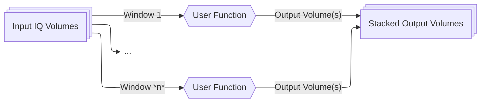
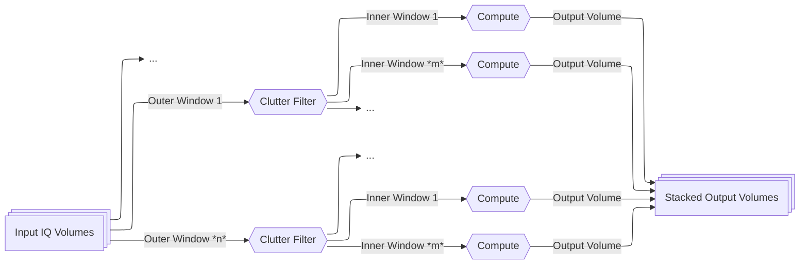

# Processing Beamformed IQ Data

## Introduction

After [loading your beamformed IQ data](io.md#loading-data), the next step in most fUSI
workflows is processing it to extract hemodynamic signals. This guide explains how to
use ConfUSIus to transform beamformed IQ data into measures like power Doppler and
axial velocity.

## Why Process IQ Data?

Beamformed IQ data contains signals from all moving and stationary structures in the
imaging field:

- **Tissue signals**: Strong echoes from slow-moving tissue (~40-60 dB stronger than
  blood).
- **Blood signals**: Weak echoes from fast-moving red blood cells.

Beamformed IQ signals can be processed to extract different types of information
depending on your application:

- **Structural imaging** (B-mode): Use amplitude information to visualize tissue
  anatomy.
- **Blood volume** (power Doppler): Separate blood from tissue to quantify
  cerebral blood volume changes.
- **Blood flow velocimetry** (color Doppler): Estimate blood flow speed and direction.
- **Tissue motion**: Track tissue displacement (e.g., cardiac pulsatility, respiration).

This guide covers the **IQ processing functions in ConfUSIus**, which focus primarily on
extracting blood volume information for fUSI applications. The typical workflow
involves:

1. **Filtering** to isolate signals of interest (e.g., blood).
2. **Computing derived measures** from the filtered IQ signals (e.g., power Doppler,
   velocity).

For fUSI specifically, this means using clutter filtering to separate blood from tissue,
then computing measures like power Doppler or axial velocity. The result is a series of
volumes showing changes in cerebral blood volume or flow.

## Understanding Your IQ Data

Before processing, it's important to understand what beamformed IQ data represents and
how it's structured.

### Quick Primer on Beamformed IQ Signals

Most fUSI users work with beamformed IQ signals rather than raw radio-frequency (RF)
signals. Indeed, ultrasound systems emit pulses at high frequencies (typically 1–30
MHz). The received echoes oscillate at these same high frequencies. However, for imaging
we only care about:

- **Amplitude**: How strong is the reflection (related to tissue properties)?
- **Phase**: How much has the phase shifted (related to motion via Doppler effect)?

IQ demodulation extracts this amplitude and phase information while discarding the
high-frequency carrier, allowing for a significant reduction in sampling rate and thus
drastically reducing data volume. A beamformed IQ sample can be represented as

$$
\text{IQ}(x, y, z, k) = A(x, y, z, k) \, e^{j\phi(x, y, z, k)},
$$

where $A$ is amplitude, $\phi$ is phase, $(x, y, z)$ are spatial coordinates, and $k$ is
the **slow-time** index.

!!! info "Slow time vs. fast time"
    - **Fast time**: RF signals sampled at MHz rates.
    - **Slow time**: Beamformed IQ signals sampled once per pulse, at kHz rates.

For single plane-wave imaging, the sampling rate of the beamformed IQ signals equals the
pulse repetition frequency (PRF), typically kHz rates. With **compound imaging** (common
in fUSI), multiple plane waves are emitted at different angles and their echoes are
combined to form a single compound volume[^montaldo2009]. In this case, the effective
sampling rate, the **compound frequency**, is the PRF divided by the number of angles,
typically hundreds of Hz. 

### Expected Data Structure

Beamformed IQ data in ConfUSIus should be a complex-valued Xarray DataArray with
dimensions `(time, z, y, x)`, where `time` is the slow-time dimension and `(z, y, x)`
are the spatial dimensions. ConfUSIus typically adopts the following convention for the
spatial dimensions:

- `z`: Elevation dimension (out-of-plane dimension for linear arrays).
- `y`: Axial dimension (depth dimension).
- `x`: Lateral dimension (dimension along the transducer array).

Additionally, ConfUSIus expects certain metadata attributes to be present:

- `compound_sampling_frequency`: Effective sampling frequency of the IQ data (Hz).
- `transmit_frequency`: Frequency of the transmitted ultrasound pulse (Hz).
- `sound_velocity`: Speed of sound used for beamforming (m/s).

!!! note "Loading IQ data from unsupported formats"
    If you've loaded IQ data from an unsupported format (i.e., not using ConfUSIus
    converters), use [`validate_iq`][confusius.validation.validate_iq] to check that your
    data has the required structure and attributes. See [Loading IQ Data from Unsupported
    Formats](io.md#loading-iq-data-from-unsupported-formats) for details.

```python
import xarray as xr

ds = xr.open_zarr("sub-01_task-rest_iq.zarr")
iq = ds["iq"]

print(iq)
```

```text
<xarray.DataArray 'iq' (time: 50000, z: 1, y: 118, x: 52)> Size: 24GB
dask.array<...>
Coordinates:
  * time     (time) float64 400kB 0.0 0.002 0.004 ... 99.994 99.996 99.998
  * z        (z) float64 8B 0.0
  * y        (y) float64 944B 4.656 4.705 4.753 ... 10.231 10.279 10.328
  * x        (x) float64 416B -2.671 -2.57 -2.469 ... 2.268 2.369 2.469
Attributes:
    voxdim:                       [0.4, 0.0485, 0.1008]
    transmit_frequency:           15625000.0
    compound_sampling_frequency:  500.0
    pulse_repetition_frequency:   15000.0
    sound_velocity:               1540.0
```

In this example, the PRF is 15 kHz, but the data uses compound imaging with a
`compound_sampling_frequency` of 500 Hz. This means each IQ sample (compound volume)
results from combining 30 individual pulses, giving an effective temporal sampling
period of 2 ms rather than 67 μs.

## How ConfUSIus Processes IQ Data

ConfUSIus offers a flexible framework for processing IQ data using sliding windows. At
its core is the [`process_iq_blocks`][confusius.iq.process_iq_blocks] function, which
allows you to run any user-defined function on sliding windows of IQ signals along the
temporal dimension. This base function is then wrapped by specialized processing
functions for common fUSI applications.

### Generic IQ Processing

The [`process_iq_blocks`][confusius.iq.process_iq_blocks] function is the
foundation of IQ processing in ConfUSIus. It provides a generic interface for applying
any user-defined function to "blocks" of IQ data using sliding temporal windows. You
will generally not call this function directly, but it is worth knowing it exists if you
ever need to implement a custom processing workflow (for example, when implementing new
clutter filters).



!!! note
    Contrary to most ConfUSIus functions,
    [`process_iq_blocks`][confusius.iq.process_iq_blocks] is a low-level function that
    expects a [Dask array](https://examples.dask.org/array.html) instead of an Xarray
    DataArray. This is because it operates on IQ data directly and returns processed
    data without metadata and coordinate handling. The wrapper functions for power
    Doppler and axial velocity handle the Xarray integration and metadata management for
    you.

### Convenience Wrappers

The specialized functions [`process_iq_to_power_doppler`][confusius.iq.process_iq_to_power_doppler]
and [`process_iq_to_axial_velocity`][confusius.iq.process_iq_to_axial_velocity] wrap
[`process_iq_blocks`][confusius.iq.process_iq_blocks] to implement a **nested sliding
window** approach:

1. **Outer windows (clutter filtering)**: A first sliding window is used for clutter
   filtering. Within each window, the clutter filter is applied to separate blood from
    tissue signals.

2. **Inner windows (derived measure computation)**: Inside each clutter-filtered window,
   a second sliding window runs to compute the desired measure (power Doppler or axial
    velocity). Multiple output volumes can be extracted from each clutter window.



This nested approach allows independent control over:

- **Clutter filtering temporal resolution**: Controlled by `clutter_window_width` and
  `clutter_window_stride`.
- **Measure computation temporal resolution**: Controlled by `doppler_window_width` /
  `velocity_window_width` and their corresponding strides.

### Memory and Performance Optimization

Beamformed IQ datasets are typically very large (tens to hundreds of GB). ConfUSIus
relies on the Dask backend for Xarray to enable out-of-core processing, allowing you to
work with datasets larger than available RAM. Dask uses **lazy evaluation**, meaning data
stays on disk until you explicitly compute results. This allows you to build complex
processing pipelines that only execute when needed.

For optimal performance, **always start a Dask distributed `Client`** before running
computations. Even for local processing (single machine), the distributed scheduler
provides significantly better performance than the default scheduler, along with task
monitoring and a web-based dashboard to track progress:

```python
from dask.distributed import Client
import xarray as xr
import confusius

# Start a local Dask cluster.
client = Client()

# The client prints a dashboard link for monitoring progress.
# Example: http://127.0.0.1:8787/status

# Load IQ data (metadata only, no data in memory yet).
iq = xr.open_zarr("large_iq_data.zarr")["iq"]

# Build computation graph (still no execution).
pwd = iq.fusi.iq.process_to_power_doppler(low_cutoff=40)

# Execute and save results (data processed in chunks, written to disk).
pwd.to_zarr("power_doppler.zarr")
```

!!! tip "Customizing the cluster"
    You can customize cluster resources based on your system:

    ```python
    # Limit workers and memory.
    client = Client(
        n_workers=4,              # Number of worker processes.
        threads_per_worker=2,     # Threads per worker.
        memory_limit="8GB"        # Memory limit per worker.
    )
    ```

    See the [Dask documentation](https://docs.dask.org/en/stable/) for more configuration
    options.

!!! tip "Computing multiple measures in a single pass"
    Since both `process_to_power_doppler` and `process_to_axial_velocity` return lazy
    Dask-backed arrays, you can compute them **simultaneously** using
    [`dask.compute`](https://docs.dask.org/en/stable/base.html#dask.compute):

    ```python
    import dask
    import confusius

    pwd = iq.fusi.iq.process_to_power_doppler(...)
    velocity = iq.fusi.iq.process_to_axial_velocity(...)

    # Compute both with a single pass over the IQ data.
    pwd, velocity = dask.compute(pwd, velocity)
    ```

    Calling `pwd.compute()` and `velocity.compute()` separately would scan through the
    IQ file twice. `dask.compute` merges the two task graphs and reads the data only
    once, which can significantly cut processing time for large datasets.

## Clutter Filtering

Clutter filtering is an essential step in fUSI processing to separate weak blood signals
from strong tissue signals. Indeed, blood signals from red blood cells are typically
40-60 dB (100-1000×) weaker than tissue signals, making effective clutter rejection
essential for detecting hemodynamic changes.

### How Clutter Filtering Works

Clutter filters exploit the different spatiotemporal characteristics of tissue and blood
signals:

- **Tissue signals**: Spatially coherent across large regions, with low temporal
  frequencies from slow tissue motion.
- **Blood signals**: Spatially localized to vascular structures, with higher temporal
  frequencies from faster blood flow.

The challenge is that tissue motion (especially in awake subjects) can create Doppler
frequencies that overlap with blood flow signals, making simple frequency-based
separation insufficient.

### Available Filter Methods

ConfUSIus provides several clutter filtering methods, each with different trade-offs:

=== "SVD-based filters"

    Singular Value Decomposition (SVD) filters exploit both spatial and temporal
    information to separate tissue from blood[^demene2015]. The SVD decomposes IQ
    signals into orthogonal components (modes) sorted by energy. Tissue motion, being
    spatially coherent and energetic, concentrates in the highest-energy modes. Blood
    flow, being spatially incoherent and weak, distributes across lower-energy modes.
    By removing the top singular vectors, tissue clutter is suppressed while
    preserving blood signals.

    **Static filter:**

    - **`svd_indices`**: Removes a fixed number of singular vectors across all windows.
      Simple and widely used, but assumes constant motion levels throughout the
      acquisition.

    **Adaptive filters:**[^baranger2018]

    - **`svd_energy`**: Adaptively determines the threshold based on individual singular
      vector energies. Adjusts to varying motion levels, but its interpretation can be
      less intuitive.
    - **`svd_cumulative_energy`**: Adaptively determines the threshold based on
      cumulative energy distribution. More robust to motion variations, but removes
      global energy variations across windows (similar to global signal regression).

    !!! info "Static vs. adaptive SVD filters"

        **Static SVD filters** (`svd_indices`) are the standard method used in the vast
        majority of fUSI studies[^ferrier2020] [^rabut2020] [^brunner2021]
        [^nunez-elizalde2022]. They are well-tested and effective for typical imaging
        conditions.

        However, static filters assume constant tissue energy levels throughout the
        acquisition. This assumption breaks down in paradigms with strong, variable tissue
        motion, such as awake preclinical imaging. In these cases, **adaptive clutter
        filters** have shown promise by adjusting thresholds to each window's
        characteristics[^lemeurdiebolt2025] [^bertolo2023].

        **Important caveats for adaptive filters:**

        - Much less tested than static filters in the fUSI literature.
        - Their impact on filtered signals can complicate interpretation.
        - `svd_energy` may over-filter signals leading to drops in power Doppler
          intensity during motion periods.
        - `svd_cumulative_energy` removes global energy variations (like global signal
          regression), which is a strong denoising step only appropriate when studying
          local effects.

        **Recommendation:**

        - Use **`svd_indices`** (static) as the default choice for most fUSI
          applications.
        - Consider **adaptive filters** only when imaging conditions involve high,
          variable motion levels (e.g., awake subjects) and you are studying local
          hemodynamic effects rather than global changes.

=== "Butterworth filter"

    Temporal high-pass Butterworth filter that removes low-frequency components.
    Uses only temporal frequency information, not spatial characteristics.

    !!! warning "Limited use for fUSI"

        Butterworth filters alone are **inadequate for fUSI** because they cannot
        separate tissue and blood when Doppler frequencies overlap (common during
        motion), and they remove slow blood flows in capillaries and small vessels.

        May be used as a pre-processing step before SVD filtering[^brunner2020]
        [^nunez-elizalde2022] [^lemeurdiebolt2025] or for specialized applications like
        tissue motion tracking.

### Filter Parameters

The interpretation of cutoff parameters depends on the filter method:

| Filter Method | `low_cutoff` | `high_cutoff` |
|---------------|--------------|---------------|
| `svd_indices` | Remove components with index < `low_cutoff` (high-energy tissue, typically 40-100). | Remove components with index ≥ `high_cutoff` (low-energy noise). |
| `svd_energy` | Remove components with energy < `low_cutoff` (low-energy noise). | Remove components with energy > `high_cutoff` (high-energy tissue). |
| `svd_cumulative_energy` | Remove components with cumulative energy < `low_cutoff` (low-energy noise). | Remove components with cumulative energy > `high_cutoff` (high-energy tissue). |
| `butterworth` | Remove frequencies below this value (Hz). | Remove frequencies above this value (Hz). |

### Clutter masks for SVD filters

For SVD-based filters, you can provide a spatial mask identifying tissue regions. This
improves filter performance by computing tissue subspaces only from masked
voxels[^lemeurdiebolt2025]:

```python
import xarray as xr

# Load a brain mask (e.g., from an anatomical atlas or segmentation).
brain_mask = xr.open_zarr("brain_mask.zarr")["mask"]

# Use the mask for clutter filtering.
pwd = iq.fusi.iq.process_to_power_doppler(
    filter_method="svd_indices",
    clutter_mask=brain_mask,
    low_cutoff=50,
)
```

## Computing Derived Measures

Once tissue clutter has been removed from IQ signals, derived measures can be computed
to quantify hemodynamic properties. In fUSI, the two primary measures are **power
Doppler** (cerebral blood volume changes) and **axial velocity** (blood flow speed and
direction).

!!! info "When clutter filtering is not needed"

    While clutter filtering is essential for isolating blood signals in fUSI, it can be
    skipped for applications focused on tissue motion rather than blood flow.

    - **Tissue velocity estimation**: Computing axial velocity without clutter filtering
      captures tissue motion, useful for extracting physiological signals like cardiac
      pulsatility and respiration[^zucker2025].
    - **Motion tracking**: Brain tissue motion can also be used to estimate animal
      movement during awake imaging[^lemeurdiebolt2025].

    To disable clutter filtering, omit both the `low_cutoff` and `high_cutoff`
    parameters.

### Power Doppler

Power Doppler allows estimation of cerebral blood volume by integrating the Doppler
power spectrum over time. It is the most common fUSI readout and is ideally suited for
mapping functional brain activity.

#### Computing Power Doppler

To compute power Doppler signals from beamformed IQ data, you may use either the
[`confusius.iq.process_iq_to_power_doppler`][confusius.iq.process_iq_to_power_doppler]
function or the corresponding Xarray accessor method.

=== "Function API"

    ```python
    from dask.distributed import Client
    import xarray as xr
    import confusius as cf

    # Start a local Dask cluster for optimal performance.
    client = Client()

    # Load IQ data.
    ds = xr.open_zarr("sub-01_task-rest_iq.zarr")
    iq = ds["iq"]

    # Process to power Doppler using SVD filtering.
    pwd = cf.iq.process_iq_to_power_doppler(
        iq,
        clutter_window_width=200,       # Use 200 volumes per clutter filter window.
        doppler_window_width=100,       # Integrate power in nested windows of 100 volumes.
        filter_method="svd_indices",    # Use the static SVD filter.
        low_cutoff=50,                  # Remove 50 strongest singular vectors.
    )
    ```

=== "Xarray accessor"

    ```python
    from dask.distributed import Client
    import xarray as xr
    import confusius

    # Start a local Dask cluster for optimal performance.
    client = Client()

    # Load IQ data.
    ds = xr.open_zarr("sub-01_task-rest_iq.zarr")
    iq = ds["iq"]

    # Process to power Doppler using SVD filtering.
    pwd = iq.fusi.iq.process_to_power_doppler(
        clutter_window_width=200,       # Use 200 volumes per clutter filter window.
        doppler_window_width=100,       # Integrate power over 100 volumes.
        filter_method="svd_indices",    # Use static SVD filter.
        low_cutoff=50,                  # Remove 50 strongest singular vectors.
    )
    ```

The resulting power Doppler DataArray will be backed by a Dask array (even if the input
wasn't Dask-backed) and rely on lazy evaluation.

```python
print(pwd)
```

```text
<xarray.DataArray 'power_doppler' (time: 860, z: 1, y: 128, x: 86)> Size: 76MB
dask.array<...>
Coordinates:
  * time     (time) float64 7kB 0.299 0.899 1.499 2.099 ... 514.5 515.1 515.7
  * z        (z) float64 8B 0.0
  * y        (y) float64 1kB 5.664 5.713 5.762 5.811 ... 11.72 11.77 11.82 11.87
  * x        (x) float64 688B -3.583 -3.492 -3.402 -3.311 ... 3.946 4.037 4.127
Attributes: (12/17)
    voxdim:                       [0.4, 0.04883074509803921, 0.09070866141732...
    transmit_frequency:           15625000.0
    compound_sampling_frequency:  500.0
    pulse_repetition_frequency:   15000.0
    sound_velocity:               1540.0
    units:                        'a.u.'
    long_name                     'Power Doppler intensity'
    clutter_filter_method:        svd_indices
    clutter_window_width:         300
    clutter_window_stride:        300
    doppler_window_width:         300
    doppler_window_stride:        300
    clutter_low_cutoff:           40
```

To actually compute the power Doppler values and load them into memory, you must call
`.compute()`:

```python
pwd = pwd.compute()
print(pwd)
```

```text
<xarray.DataArray 'power_doppler' (time: 860, z: 1, y: 128, x: 86)> Size: 76MB
array([[[[74.26474299, 76.99585806, 84.46316397, ..., 79.11284661,
          77.6835962 , 69.19274666],
         [70.16886299, 83.84617566, 76.62624364, ..., 74.06344271,
          74.82030741, 74.48822094],
         ...
...
```

!!! info "Processing parameters"
    For detailed documentation of all parameters (window widths, strides, filter methods,
    cutoffs, etc.), see the API reference for
    [`process_iq_to_power_doppler`][confusius.iq.process_iq_to_power_doppler].

### Axial Velocity

Axial velocity estimation quantifies the speed and direction of blood flow along the
ultrasound beam axis using autocorrelation-based methods.

#### Computing Axial Velocity

To compute axial velocity from beamformed IQ data, you may use either the
[`confusius.iq.process_iq_to_axial_velocity`][confusius.iq.process_iq_to_axial_velocity]
function or the corresponding Xarray accessor method.

=== "Function API"

    ```python
    from dask.distributed import Client
    import xarray as xr
    import confusius as cf

    # Start a local Dask cluster for optimal performance.
    client = Client()

    # Load IQ data.
    ds = xr.open_zarr("sub-01_task-rest_iq.zarr")
    iq = ds["iq"]

    # Process to axial velocity using SVD filtering.
    velocity = cf.iq.process_iq_to_axial_velocity(
        iq,
        clutter_window_width=50,
        velocity_window_width=50,
        filter_method="svd_indices",
        low_cutoff=50,
        lag=1,                          # Autocorrelation lag (volumes).
        estimation_method="average_angle",  # Velocity estimation method.
    )
    ```

=== "Xarray accessor"

    ```python
    from dask.distributed import Client
    import xarray as xr
    import confusius

    # Start a local Dask cluster for optimal performance.
    client = Client()

    # Load IQ data.
    ds = xr.open_zarr("sub-01_task-rest_iq.zarr")
    iq = ds["iq"]

    # Process to axial velocity using SVD filtering.
    velocity = iq.fusi.iq.process_to_axial_velocity(
        clutter_window_width=50,
        velocity_window_width=50,
        filter_method="svd_indices",
        low_cutoff=50,
        lag=1,                          # Autocorrelation lag (volumes).
        estimation_method="average_angle",  # Velocity estimation method.
    )
    ```

The resulting axial velocity DataArray will be backed by a Dask array (even if the input
wasn't Dask-backed) and rely on lazy evaluation.

```python
print(velocity)
```

```text
<xarray.DataArray (time: 1000, z: 1, y: 118, x: 52)> Size: 24MB
dask.array<...>
Coordinates:
  * time     (time) float64 8kB 0.024 0.074 0.124 ... 99.874 99.924 99.974
  * z        (z) float64 8B 0.0
  * y        (y) float64 944B 4.656 4.705 4.753 ... 10.231 10.279 10.328
  * x        (x) float64 416B -2.671 -2.57 -2.469 ... 2.268 2.369 2.469
Attributes:
    units:    m/s
```

!!! info "Processing parameters"
    For detailed documentation of all parameters (lag, estimation method, spatial kernel,
    etc.), see the API reference for
    [`process_iq_to_axial_velocity`][confusius.iq.process_iq_to_axial_velocity].

#### Interpreting Velocity

Velocity values are returned in **meters per second** with sign indicating direction:

- **Positive values**: Flow toward the transducer.
- **Negative values**: Flow away from the transducer.
- **Magnitude**: Speed of flow.

!!! warning "Velocity aliasing"
    Very high velocities may exceed the Nyquist limit and cause aliasing (wrapping). If
    you observe sudden sign reversals in high-flow regions, reduce the `lag` parameter or
    increase the pulse repetition frequency during acquisition.

## Next Steps

Now that you've processed your beamformed IQ data into power Doppler or velocity
volumes, you're ready to:

1. **[Quality Control](qc.md)**: assess data quality and identify artifacts *(coming
   soon)*
2. **[Visualization](visualization.md)**: explore your data interactively with Napari
   *(coming soon)*
3. **[Registration](registration.md)**: correct for motion and align to anatomical
   templates *(coming soon)*
4. **[Signal Processing](signal.md)**: extract regional signals and apply denoising
   *(coming soon)*

[^montaldo2009]:
    Montaldo, G., et al. "Coherent Plane-Wave Compounding for Very High Frame Rate
    Ultrasonography and Transient Elastography." IEEE Transactions on Ultrasonics,
    Ferroelectrics and Frequency Control, vol. 56, no. 3, Mar. 2009, pp. 489–506. DOI.org
    (Crossref), <https://doi.org/10.1109/TUFFC.2009.1067>.

[^demene2015]:
    Demené, Charlie, et al. "Spatiotemporal Clutter Filtering of Ultrafast Ultrasound
    Data Highly Increases Doppler and fUltrasound Sensitivity." IEEE Transactions on
    Medical Imaging, vol. 34, no. 11, Nov. 2015, pp. 2271–85. DOI.org (Crossref),
    <https://doi.org/10.1109/TMI.2015.2428634>.

[^baranger2018]:
    Baranger, J., et al. "Adaptive Spatiotemporal SVD Clutter Filtering for Ultrafast
    Doppler Imaging Using Similarity of Spatial Singular Vectors." IEEE Transactions on
    Medical Imaging, vol. 37, no. 7, 2018, pp. 1574–86. DOI.org (Crossref),
    <https://doi.org/10.1109/TMI.2018.2789499>.

[^lemeurdiebolt2025]:
    Le Meur-Diebolt, Samuel, et al. "Robust Functional Ultrasound Imaging in the Awake
    and Behaving Brain: A Systematic Framework for Motion Artifact Removal." bioRxiv,
    17 June 2025. DOI.org (Crossref), <https://doi.org/10.1101/2025.06.16.659882>.

[^bertolo2023]:
    Bertolo, Adrien, et al. "High Sensitivity Mapping of Brain-Wide Functional Networks
    in Awake Mice Using Simultaneous Multi-Slice fUS Imaging." Imaging Neuroscience,
    vol. 1, Nov. 2023, p. imag_a_00030. DOI.org (Crossref),
    <https://doi.org/10.1162/imag_a_00030>.

[^brunner2020]:
    Brunner, Clément, et al. "A Platform for Brain-Wide Volumetric Functional Ultrasound
    Imaging and Analysis of Circuit Dynamics in Awake Mice." Neuron, vol. 108, no. 5,
    Dec. 2020, pp. 861–875.e7. DOI.org (Crossref),
    <https://doi.org/10.1016/j.neuron.2020.09.020>.

[^zucker2025]:
    Zucker, Nicolas, et al. “Physio-fUS: A Tissue-Motion Based Method for Heart and
    Breathing Rate Assessment in Neurofunctional Ultrasound Imaging.” eBioMedicine, vol.
    112, Feb. 2025, p. 105581. DOI.org (Crossref),
    <https://doi.org/10.1016/j.ebiom.2025.105581>.

[^ferrier2020]:
    Ferrier, Jeremy, et al. “Functional Imaging Evidence for Task-Induced Deactivation
    and Disconnection of a Major Default Mode Network Hub in the Mouse Brain.” Proceedings
    of the National Academy of Sciences, vol. 117, no. 26, June 2020, pp. 15270–80. DOI.org
    (Crossref), <https://doi.org/10.1073/pnas.1920475117>.

[^rabut2020]:
    Rabut, Claire, et al. “Pharmaco-fUS: Quantification of Pharmacologically-Induced
    Dynamic Changes in Brain Perfusion and Connectivity by Functional Ultrasound Imaging
    in Awake Mice.” NeuroImage, vol. 222, Nov. 2020, p. 117231. DOI.org (Crossref),
    <https://doi.org/10.1016/j.neuroimage.2020.117231>.

[^brunner2021]:
    Brunner, Clément, et al. “Whole-Brain Functional Ultrasound Imaging in Awake
    Head-Fixed Mice.” Nature Protocols, vol. 16, no. 7, July 2021, pp. 3547–71. DOI.org
    (Crossref), <https://doi.org/10.1038/s41596-021-00548-8>.

[^nunez-elizalde2022]:
    Nunez-Elizalde, Anwar O., et al. “Neural Correlates of Blood Flow Measured by
    Ultrasound.” Neuron, vol. 110, no. 10, May 2022, pp. 1631-1640.e4. DOI.org
    (Crossref), <https://doi.org/10.1016/j.neuron.2022.02.012>.
