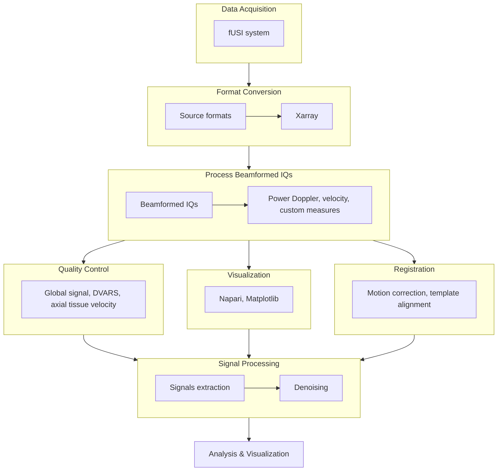

# Getting Started

Welcome to ConfUSIus! This guide introduces the package and helps you understand how it
fits into a typical fUSI data analysis workflow.

## What is ConfUSIus?

ConfUSIus is a Python package for handling, processing, and analyzing functional
ultrasound imaging (fUSI) data. It provides tools for the entire fUSI analysis
pipeline, from converting raw beamformed IQ data to processing hemodynamic signals and
performing statistical analyses.

## What is fUSI?

Functional ultrasound imaging (fUSI) is a neuroimaging technique that measures brain
activity by detecting changes in cerebral blood volume[^mace2011] [^deffieux2021]
[^montaldo2022]. fUSI offers:

- **High spatiotemporal resolution**: Sub-millimeter spatial resolution (~100 μm
  in-plane and ~500 μm out-of-plane with 15 MHz probes) with temporal resolution on
  the order of 0.5–10 Hz, depending on the acquisition protocol.
- **Wide field of view**: Ability to image large cortical and subcortical regions
  simultaneously.
- **Awake preclinical imaging**: Compatible with awake, behaving animals and various
  experimental paradigms.
- **Multimodal integration**: Can be combined with electrophysiology, optogenetics, and
  other techniques for comprehensive studies of brain function.

For more information on fUSI, check out this review article: [Functional Ultrasound
Neuroimaging](https://www.annualreviews.org/doi/10.1146/annurev-neuro-111020-100706) by
Montaldo _et al._ (2022).

fUSI data typically consists of large 3D+t datasets (time × z × y × x) acquired from
fUSI systems (for example, [Iconeus](https://iconeus.com/),
[AUTC](https://fusi-functional-ultrasound-imaging.com/), EchoFrame, or in-house setups
based on ultrasound research platforms such as [Verasonics](https://verasonics.com/)).

## Key Features

ConfUSIus provides a comprehensive toolkit designed specifically for fUSI data:

=== "Data I/O"
    - Convert beamformed IQ data (AUTC, EchoFrame) to Zarr.
    - Load and save NIfTI files with BIDS sidecar support.
    - Work with Zarr for cloud-native, chunked storage.

=== "Beamformed IQ"
    - Clutter filtering for separating tissue and blood signals.
    - Power Doppler and velocity estimation from beamformed IQ data.

=== "Quality Control"
    - Quality control metrics.
    - Quality control visualizations.

=== "Registration"
    - Motion correction using volume-wise registration.
    - Registration between acquisitions.

=== "Visualization"
    - Interactive exploration of 3D+t datasets using Napari.
    - Static figure generation using Matplotlib.

=== "Signal Processing"
    - Extraction of signals using region masking.
    - Denoising and filtering of hemodynamic signals.

=== "Analysis"
    - Statistical analysis of fUSI data.
    - Interoperability with other Python scientific libraries (Nilearn, scikit-learn,
      statsmodels, etc.).

## Typical Workflow

ConfUSIus supports the complete fUSI analysis pipeline, from raw data acquisition to statistical analysis and visualization:

### Workflow Stages

1. **Data Acquisition**: Acquire beamformed IQ data from your ultrasound system (AUTC,
   EchoFrame, Iconeus, or custom setups).
2. **Format Conversion**: Convert proprietary formats to Xarray-compatible formats
   (typically Zarr for large datasets, or NIfTI for BIDS compliance).
3. **Process Beamformed IQs**: Apply clutter filtering and extract hemodynamic signals
   such as power Doppler, velocity, or custom measures from beamformed IQ data.
4. **Quality Control, Visualization & Registration**: These steps can be performed in
   parallel as needed:

    - Monitor data quality using metrics like global signal, DVARS, or axial tissue
      velocity.
    - Explore data interactively with Napari or create static figures with Matplotlib.
    - Perform motion correction or align acquisitions to a template.

5. **Signal Processing**: Extract signals from specific brain regions and apply
   denoising and filtering.
6. **Analysis**: Perform statistical analyses or integrate with other Python scientific
   libraries.

!!! tip "Entering ConfUSIus at any stage"
    You don't need to start from beamformed IQ data. If you already have processed
    acquisitions (e.g., power Doppler in NIfTI format), you can enter the pipeline at
    any stage—quality control, registration, signal processing, or analysis.

## When to Use ConfUSIus

ConfUSIus is designed for researchers and analysts working with fUSI data who need:

- **Efficient handling of large datasets**: Process large-scale beamformed IQ data
  without running out of memory.
- **Standardized workflows**: Follow fUSI-BIDS conventions for reproducible research.
- **Python integration**: Work with modern scientific Python tools (NumPy, Xarray, Dask,
  scikit-learn).
- **Flexibility**: Customize processing pipelines while using battle-tested components.

## Before You Begin

ConfUSIus is built on several key technologies:

- **[Xarray](https://docs.xarray.dev/)**: Labeled multi-dimensional arrays with
  metadata.
- **[Zarr](https://zarr.readthedocs.io/)**: Chunked, compressed array storage for large
  datasets.
- **[Dask](https://www.dask.org/)**: Parallel computing and out-of-core processing.

If you're new to these tools, check out the [Working with Xarray](xarray.md) section to
get familiar with the core concepts. You may also want to review the [Input/Output
Guide](io.md) to understand how ConfUSIus handles data formats.

## Next Steps

Ready to get started?

1. **[Install ConfUSIus](installation.md)**: Set up your environment and install the
   package.
2. **[I/O Guide](io.md)**: Learn how to load and convert your fUSI data.
3. **[Examples](../examples/index.md)**: See complete workflows for common tasks.
4. **[API Reference](../api/index.md)**: Explore detailed function documentation.

Still have questions? Check the [GitHub issues](https://github.com/sdiebolt/confusius/issues) or open a new one!

## Useful Python Resources for fUSI

While ConfUSIus offers many features to handle fUSI data, it obviously does not do
everything. Below are some useful resources to read and packages to use alongside
ConfUSIus.

- [Xarray](https://docs.xarray.dev/en/stable/getting-started-guide/why-xarray.html):
  ConfUSIus relies on Xarray for storing volumetric fUSI data. Learning how to use
  Xarray efficiently will get you a long way.
- [Dask](https://docs.dask.org/en/stable/): Dask is a Python package for distributed
  parallel computing. Xarray supports Dask arrays as backend, and ConfUSIus relies on
  them notably for processing large beamformed IQ datasets. Xarray's user guide on
  [parallel computing with Dask](https://docs.xarray.dev/en/stable/user-guide/dask.html)
  might also be a good read.
- [Zarr](https://zarr.readthedocs.io/en/stable/): Zarr is a chunked, compressed array
  storage for large N-dimensional datasets. ConfUSIus relies on Zarr for storing
  beamformed IQ data, and large derived measures. Zarr's user guide on [optimizing
  performance](https://zarr.readthedocs.io/en/stable/user-guide/performance/) is a
  useful resource if you intend to work with very large beamformed IQ datasets.
- [Brain Imaging Data Structure](https://bids-specification.readthedocs.io/en/stable/):
  ConfUSIus relies on BIDS for storing metadata alongside NIfTI files. Even if you don't
  use NIfTI as your storage format, following BIDS conventions can help you organize and
  share your datasets later. You may also want to take a look at the [fUSI-BIDS
  specification
  draft](https://docs.google.com/document/d/1W3z01mf1E8cfg_OY7ZGqeUeOKv659jCHQBXavtmT-T8/edit?usp=sharing)
  and to [PyBIDS](https://bids-standard.github.io/pybids/).
- [Nilearn](https://nilearn.github.io/stable/index.html): Nilearn is a versatile package
  for analysis of brain volumes and surfaces. While it is mostly geared toward fMRI,
  many fUSI users have found it useful for analyzing fUSI data. ConfUSIus itself
  borrows some of Nilearn's features.
- [SimpleITK](https://simpleitk.org/): SimpleITK offers a simple wrapper API over ITK,
  the widely used image segmentation and image registration library. ConfUSIus builds on
  SimpleITK for image registration.
- [Matplotlib](https://matplotlib.org/stable/): The obvious choice for creating static
  figures in Python.
- [PyVista](https://pyvista.org/): While ConfUSIus uses Napari to allow for 3D
  rendering, PyVista offers a simple API to make custom 3D visualizations.

[^mace2011]:
    Macé, Emilie, et al. “Functional Ultrasound Imaging of the Brain.” Nature Methods,
    vol. 8, no. 8, Aug. 2011, pp. 662–64. DOI.org (Crossref),
    <https://doi.org/10.1038/nmeth.1641>.

[^deffieux2021]:
    Deffieux, Thomas, et al. “Functional Ultrasound Imaging: A New Imaging Modality for
    Neuroscience.” Neuroscience, vol. 474, Oct. 2021, pp. 110–21. DOI.org (Crossref),
    <https://doi.org/10.1016/j.neuroscience.2021.03.005>.

[^montaldo2022]:
    Montaldo, Gabriel, et al. “Functional Ultrasound Neuroimaging.” Annual Review of
    Neuroscience, vol. 45, no. 1, July 2022, pp. 491–513. DOI.org (Crossref),
    <https://doi.org/10.1146/annurev-neuro-111020-100706>.

