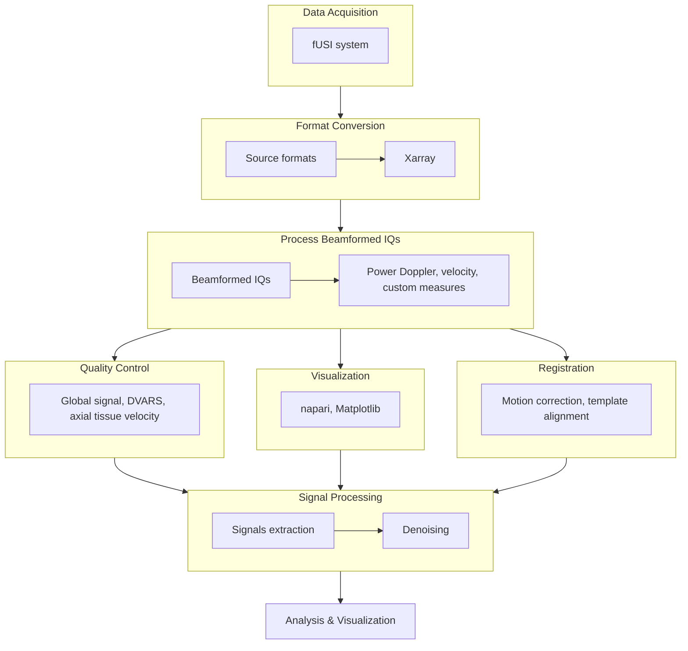

# Getting Started

Welcome to ConfUSIus! This guide introduces the package and helps you understand how it
fits into a typical fUSI data analysis workflow.

## What is fUSI?

Functional ultrasound imaging (fUSI) is a neuroimaging technique that measures brain
activity by detecting changes in cerebral blood volume[^mace2011] [^deffieux2021]
[^montaldo2022]. fUSI offers:

- **High spatiotemporal resolution**: Sub-millimeter spatial resolution (~100 μm
  in-plane and ~500 μm out-of-plane with 15 MHz linear probes) with temporal resolution
  on the order of 0.5–10 Hz, depending on the acquisition protocol.
- **Wide field of view**: Ability to image large cortical and subcortical regions
  simultaneously.
- **Awake preclinical imaging**: Compatible with awake, behaving animals and various
  experimental paradigms.
- **Multimodal integration**: Can be combined with electrophysiology, optogenetics, and
  other techniques for comprehensive studies of brain function.

For more information on fUSI, check out this review article: [Functional Ultrasound
Neuroimaging](https://www.annualreviews.org/doi/10.1146/annurev-neuro-111020-100706) by
Montaldo _et al._ (2022).

fUSI data typically consists of large 3D+t datasets (time × z × y × x) acquired from
fUSI systems (for example, [Iconeus](https://iconeus.com/),
[AUTC](https://fusi-functional-ultrasound-imaging.com/), EchoFrame, or in-house setups
based on ultrasound research platforms such as [Verasonics](https://verasonics.com/)).

## What is ConfUSIus?

ConfUSIus is a Python package for handling, processing, and analyzing functional
ultrasound imaging (fUSI) data. It provides tools for the entire fUSI analysis
pipeline, from converting raw beamformed IQ data to processing hemodynamic signals and
performing statistical analyses. It also ships a [napari](https://napari.org) plugin
for interactive data exploration.

!!! tip "Prefer not to script?"
    The [ConfUSIus napari plugin](../gui/overview.md) is a good starting point if you
    want to explore a dataset before writing any analysis code. It covers data loading
    and exploration, time series inspection, and quality control—all without scripting.

## Key Features

ConfUSIus provides a comprehensive toolkit designed specifically for fUSI data:

=== "Data I/O"
    - Convert AUTC and EchoFrame beamformed IQ data to Zarr for efficient processing.
    - Load Zarr, NIfTI, and Iconeus SCAN files as labeled Xarray DataArrays.
    - Load and save NIfTI files with automatic fUSI-BIDS JSON sidecar handling.
    - Save DataArrays to Zarr for chunked, large-scale processing.

=== "Beamformed IQ"
    - SVD-based clutter filtering to separate blood from tissue signals.
    - Compute power Doppler, B-mode, and axial velocity images from filtered IQ data.
    - A general-purpose block-processing primitive lets you apply any custom function
      to IQ blocks efficiently using Dask sliding windows.

=== "Quality Control"
    - Temporal metric: DVARS for detecting outlier volumes.
    - Spatial metrics: coefficient of variation (CV) for mapping high-variance regions,
      and tSNR for compatibility with fMRI-style workflows (with caveats for power
      Doppler).
    - Carpet plots (grayplots) to spot global disturbances, motion spikes, and scanner
      drift.

=== "Registration"
    - Frame-by-frame motion correction with rigid or affine transforms; framewise
      displacement and motion parameter extraction for downstream scrubbing.
    - Volume registration for inter-session alignment or atlas co-registration (rigid,
      affine, or deformable B-spline transforms).

=== "Visualization"
    - **Napari plugin**: Graphical interface for data loading and exploration, time
      series inspection, and quality control—no scripting required.
    - **Programmatic napari**: Interactive 3D+t exploration from scripts or notebooks.
    - **Matplotlib**: Static figure generation for publications and reports.

=== "Signal Processing"
    - Extract voxel-wise or region-averaged signals using binary masks or label maps.
    - Clean time series in one step: confound regression (including CompCor),
      Butterworth filtering (low-, high-, or band-pass), detrending, and
      standardization.
    - Censor or interpolate motion-contaminated samples identified during QC.

=== "Atlas Integration"
    - Load any BrainGlobe-compatible atlas (Allen CCFv3, Waxholm, and more).
    - Generate region masks and label maps for targeted signal extraction.
    - Resample atlases to match your acquisition grid; overlay region contours on fUSI
      images.

=== "Analysis"
    - Seed-based correlation maps and region-to-region functional connectivity matrices.
    - General linear models (GLMs) for task-based and event-related designs.
    - Interoperability with Nilearn, scikit-learn, statsmodels, and other scientific
      Python libraries.

## Typical Workflow

ConfUSIus supports the complete fUSI analysis pipeline, from raw data acquisition to statistical analysis and visualization:

```mermaid
 flowchart TB
    subgraph acquire["Data Acquisition"]
        A[fUSI system]
    end

    acquire --> convert

    subgraph convert["Format Conversion"]
        B["Source formats"]
        C[Xarray]
        B --> C
    end

    convert --> process

    subgraph process["Process Beamformed IQs"]
        D[Beamformed IQs]
        E[Power Doppler, velocity, custom measures]
        D --> E
    end

    process --> qc
    process --> visualization
    process --> registration

    subgraph qc["Quality Control"]
        qcmeasures[Global signal, DVARS, axial tissue velocity]
    end

    subgraph visualization["Visualization"]
        plotting[napari, Matplotlib]
    end

    subgraph registration["Registration"]
        motioncorr[Motion correction, template alignment]
    end

    qc --> signal
    visualization --> signal
    registration --> signal

    subgraph signal["Signal Processing"]
        extract[Signals extraction]
        denoising[Denoising]
        extract --> denoising
    end

    signal --> analyze

    analyze["Analysis & Visualization"]
```

### Workflow Stages

1. **Data Acquisition**: Acquire beamformed IQ data from your ultrasound system (AUTC,
   EchoFrame, Iconeus, or custom setups).
2. **Format Conversion**: Convert proprietary formats to Xarray-compatible formats
   (typically Zarr for large datasets, or NIfTI for BIDS compliance).
3. **Process Beamformed IQs**: Apply clutter filtering and extract hemodynamic signals
   such as power Doppler, velocity, or custom measures from beamformed IQ data.
4. **Quality Control, Visualization & Registration**: These steps can be performed in
   parallel as needed:

    - Monitor data quality using metrics like global signal, DVARS, or axial tissue
      velocity.
    - Explore data interactively with napari or create static figures with Matplotlib.
    - Perform motion correction or align acquisitions to a template.

5. **Signal Processing**: Extract signals from specific brain regions and apply
   denoising and filtering.
6. **Analysis**: Perform statistical analyses or integrate with other Python scientific
   libraries.

!!! tip "Entering ConfUSIus at any stage"
    You don't need to start from beamformed IQ data. If you already have processed
    acquisitions (e.g., power Doppler in NIfTI format), you can enter the pipeline at
    any stage—quality control, registration, signal processing, or analysis.

## When to Use ConfUSIus

ConfUSIus is designed for anyone working with fUSI data:

- **Comprehensive fUSI toolkit**: ConfUSIus covers the entire analysis pipeline in a
  single, actively maintained open-source package—from IQ processing and quality control
  to atlas integration, signal extraction, and connectivity analysis.
- **Accessible at every skill level**: Non-programmers can use the
  [napari plugin](../gui/overview.md) for interactive data loading, time series
  inspection, and quality control. Python users can build fully custom pipelines using
  the scripting API.
- **Python ecosystem integration**: Works seamlessly with NumPy, Xarray, Dask, Nilearn,
  scikit-learn, and other scientific Python libraries.
- **Standardized workflows**: Follow fUSI-BIDS conventions for reproducible,
  shareable research.
- **Scalable to large datasets**: Process large beamformed IQ datasets out-of-core using
  Dask and Zarr without running out of memory.

## Before You Begin

ConfUSIus is built on several key technologies:

- **[Xarray](https://docs.xarray.dev/)**: Labeled multi-dimensional arrays with
  metadata.
- **[Zarr](https://zarr.readthedocs.io/)**: Chunked, compressed array storage for large
  datasets.
- **[Dask](https://www.dask.org/)**: Parallel computing and out-of-core processing.

If you're new to these tools, check out the [Working with Xarray](xarray.md) section to
get familiar with the core concepts. You may also want to review the [Input/Output
Guide](io.md) to understand how ConfUSIus handles data formats.

## Next Steps

Ready to get started?

1. **[Install ConfUSIus](installation.md)**: Set up your environment and install the
   package.
2. **[I/O Guide](io.md)**: Learn how to load and convert your fUSI data.
3. **[Graphical Interface](../gui/overview.md)**: Explore your data interactively with
   the napari plugin—no scripting required.
4. **[Examples](../examples/index.md)**: See complete workflows for common tasks.
5. **[API Reference](../api/index.md)**: Explore detailed function documentation.

Still have questions? Check the [GitHub
issues](https://github.com/sdiebolt/confusius/issues) or open a new one! You can also
join the [fUSI community Discord](https://discord.gg/mZd87tgmy2) to ask questions and
connect with other researchers using fUSI.

## Getting Help

We host weekly drop-in hours on the [fUSI community
Discord](https://discord.gg/mZd87tgmy2) usually every **Thursday from 3pm to 4pm UTC**.
Join us in the `drop-in-hours` voice channel to:

- Get help with ConfUSIus usage and troubleshooting.
- Discuss new features and provide feedback.
- Connect with other fUSI researchers.
- Report bugs in an informal setting.

You can also use the `help-desk` text channel anytime for questions.

We post on [Bluesky](https://bsky.app/profile/sdiebolt.bsky.social) in advance to
confirm each week's session.

## Useful Python Resources for fUSI

While ConfUSIus offers many features to handle fUSI data, it obviously does not do
everything. Below are some useful resources to read and packages to use alongside
ConfUSIus.

- [Xarray](https://docs.xarray.dev/en/stable/getting-started-guide/why-xarray.html):
  ConfUSIus relies on Xarray for storing volumetric fUSI data. Learning how to use
  Xarray efficiently will get you a long way.
- [Dask](https://docs.dask.org/en/stable/): Dask is a Python package for distributed
  parallel computing. Xarray supports Dask arrays as backend, and ConfUSIus relies on
  them notably for processing large beamformed IQ datasets. Xarray's user guide on
  [parallel computing with Dask](https://docs.xarray.dev/en/stable/user-guide/dask.html)
  might also be a good read.
- [Zarr](https://zarr.readthedocs.io/en/stable/): Zarr is a chunked, compressed array
  storage for large N-dimensional datasets. ConfUSIus relies on Zarr for storing
  beamformed IQ data, and large derived measures. Zarr's user guide on [optimizing
  performance](https://zarr.readthedocs.io/en/stable/user-guide/performance/) is a
  useful resource if you intend to work with very large beamformed IQ datasets.
- [Brain Imaging Data Structure](https://bids-specification.readthedocs.io/en/stable/):
  ConfUSIus uses BIDS conventions when reading and writing JSON sidecars alongside NIfTI
  files. Even if you don't use NIfTI as your storage format, following BIDS conventions
  can help you organize and share your datasets later. You may also want to take a look
  at the [fUSI-BIDS
  specification
  draft](https://docs.google.com/document/d/1W3z01mf1E8cfg_OY7ZGqeUeOKv659jCHQBXavtmT-T8/edit?usp=sharing)
  and at [PyBIDS](https://bids-standard.github.io/pybids/).
- [Nilearn](https://nilearn.github.io/stable/index.html): Nilearn is a versatile package
  for analysis of brain volumes and surfaces. While it is mostly geared toward fMRI,
  many fUSI users have found it useful for analyzing fUSI data. ConfUSIus itself
  borrows some of Nilearn's features.
- [SimpleITK](https://simpleitk.org/): SimpleITK offers a simple wrapper API over ITK,
  the widely used image segmentation and image registration library. ConfUSIus builds on
  SimpleITK for image registration.
- [BrainGlobe](https://brainglobe.info/): BrainGlobe is a suite of Python-based software
  tools for computational neuroanatomy. Of particular interest is the [BrainGlobe Atlas
  API](https://brainglobe.info/documentation/brainglobe-atlasapi/index.html), which
  provides a common interface to download and process brain atlases from multiple sources.
  ConfUSIus builds on the BrainGlobe Atlas API for atlas integration.
- [Matplotlib](https://matplotlib.org/stable/): The obvious choice for creating static
  figures in Python.
- [PyVista](https://pyvista.org/): While ConfUSIus uses napari for 3D rendering, PyVista
  also offers a simple API to make custom 3D visualizations.

[^mace2011]:
    Macé, Emilie, et al. “Functional Ultrasound Imaging of the Brain.” Nature Methods,
    vol. 8, no. 8, Aug. 2011, pp. 662–64. DOI.org (Crossref),
    <https://doi.org/10.1038/nmeth.1641>.

[^deffieux2021]:
    Deffieux, Thomas, et al. “Functional Ultrasound Imaging: A New Imaging Modality for
    Neuroscience.” Neuroscience, vol. 474, Oct. 2021, pp. 110–21. DOI.org (Crossref),
    <https://doi.org/10.1016/j.neuroscience.2021.03.005>.

[^montaldo2022]:
    Montaldo, Gabriel, et al. “Functional Ultrasound Neuroimaging.” Annual Review of
    Neuroscience, vol. 45, no. 1, July 2022, pp. 491–513. DOI.org (Crossref),
    <https://doi.org/10.1146/annurev-neuro-111020-100706>.
