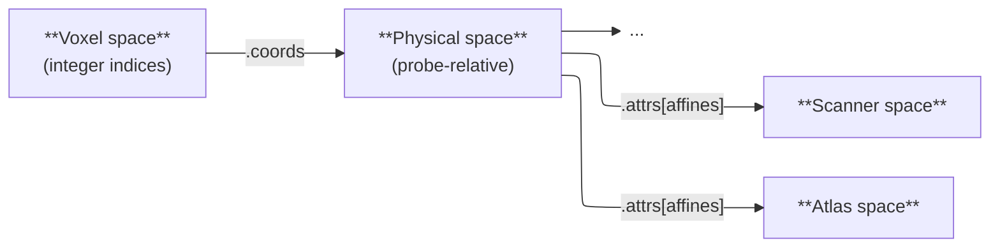

# Spatial Conventions

ConfUSIus works with three kinds of coordinate systems:

- the **voxel space**, linked to the underlying array storage and indexed by integer
  voxel coordinates,
- the **physical space** embedded in every DataArray's coordinates,
- and any number of **world spaces** (atlas, scanner, etc.) linked to the physical space
  through affine transforms stored in `attrs["affines"]`.

Understanding these three spaces and the axis-ordering convention used throughout
ConfUSIus makes it much easier to reason about I/O, registration, and downstream
statistical analysis.



## Axis Ordering: `(time, z, y, x)`

Every ConfUSIus DataArray that represents a fUSI recording uses the dimension order
`(time, z, y, x)`, where:

| Dimension | Physical axis | Typical size |
|---|---|---|
| `time` | Acquisition time | Thousands |
| `z` | Elevation (stacking direction) | 1 for 2D acquisitions |
| `y` | Axial / depth | Tens to hundreds |
| `x` | Lateral | Tens to hundreds |

This ordering is motivated by several considerations.

- **Equivalence with NIfTI:** NIfTI stores arrays in column-major (Fortran) order with
  axis sequence `(x, y, z, time)`. NumPy (and Python in general) uses row-major (C)
  order arrays by default. Transposing a `(x, y, z, time)` NIfTI array is a zero-copy
  operation that leads to a `(time, z, y, x)` array in row-major order.
- **Acquisition and processing order:** fUSI data is acquired and processed volume by
  volume. In NumPy's row-major (C) layout the last axes are contiguous in memory, so
  `data[t]`—a single spatial volume—is a contiguous block. This matches the
  natural unit of work for block-wise IQ processing, motion correction, and other
  volume-wise operations.
- **Statistical analysis convention:** After spatial processing, fUSI data is typically
  reshaped to a 2D `(time, voxels)` matrix to run general linear models, dimensionality
  reduction, and similar analyses. In Xarray, this reshape is as simple as
  `data.stack(voxels=["z", "y", "x"])`, matching the standard `(samples, features)`
  convention used by libraries like [scikit-learn](https://scikit-learn.org/stable/) and
  [statsmodels](https://www.statsmodels.org/stable/index.html).
- **Alignment with standard neuroanatomical atlases:** In preclinical fUSI, the probe
  is typically a linear or multi-array transducer translated along the antero-posterior
  axis using a motorized stage, yielding coronal images. In this common setup,
  `(z, y, x) = (elevation, axial/depth, lateral)` maps to
  `(antero-posterior, superior-inferior, left-right)` in anatomical terms, forming a
  right-handed coordinate system. [BrainGlobe](https://brainglobe.info) atlases such as
  the Allen Mouse Brain Atlas use `ASR` orientation (origin at the most anterior,
  superior, right corner), giving axes `(antero-posterior, superior-inferior,
  right-left)` — a left-handed system that shares the first two axes with ConfUSIus but
  has an opposite lateral direction. The physical → world affine captures this lateral
  mirror, making registration with standard atlases straightforward.
- **Visualization:** Most visualization tools (e.g. Napari) expect the last
  two axes to be the display axes of a 2D image. With `(time, z, y, x)`, indexing a
  single time point and elevation slice—`data.sel(t=t, z=z)`—yields a `(y, x)` array
  that plots correctly without transposing. For 2D acquisitions where `z` has size 1,
  `data[t, 0]` is the natural way to access a single frame.

## Coordinate Systems

### Voxel Space

Voxel space has its origin at voxel `(0, 0, 0)` and integer indices along each
spatial axis. It is the natural indexing space of the underlying array: DataArrays can
be indexed in voxel space using the standard Xarray integer-location indexer (`.isel`).

Moreover, NIfTI files store affine transformations, `qform` and `sform`, that map voxel
space to world spaces. When a NIfTI file is loaded in ConfUSIus using
[`load_nifti`][confusius.io.load_nifti], the relevant affine(s) are read and converted
to physical → world form, then stored in `da.attrs["affines"]`.

### Physical Space

The physical space is the coordinate system embedded in the DataArray's dimension
coordinates. Its axes are `(z, y, x)` corresponding to `(elevation, axial/depth,
lateral)`. The unit of the coordinates is determined by the `units` attribute of each
coordinate array and is not fixed by ConfUSIus — millimeters are typical for fUSI, but
any consistent unit can be used.

The origin is typically the center of the probe surface, but users are free to define
any physical space they find convenient. What matters is that the coordinate values
are internally consistent and carry a meaningful physical scale.

Physical coordinates are set at data-loading time and depend on the source format:

- **EchoFrame**: Lateral and axial coordinates are read from the acquisition metadata
  file.
- **AUTC**: Lateral and axial coordinates are supplied by the user as parameters to the
  conversion function. If coordinates are omitted, ConfUSIus falls back to bare voxel
  indices and emits a warning.
- **NIfTI**: Coordinates are derived from the translation and scale components of the
  "best" affine transformation found in the file header.
- **Hand-constructed DataArrays**: The physical space is whatever the user assigns to
  the dimension coordinates.

!!! tip "The "best" NIfTI affine"
    NIfTI files can store two affine transforms in their header: an `sform` and a
    `qform`, each with an associated integer code indicating whether the affine is
    valid (`code > 0`) and which space it points to. ConfUSIus follows the NIfTI
    specification: if `sform_code > 0` the `sform` is used; otherwise, if
    `qform_code > 0` the `qform` is used. If both codes are zero a warning is emitted
    and coordinates fall back to a diagonal affine built from the `pixdim` field.

Each spatial coordinate also carries a `voxdim` attribute that records the native voxel
size along that dimension:

```python
da.coords["y"].attrs["voxdim"]  # native axial voxel size.
```

This is set at load time alongside the physical coordinates and is preserved through
any Xarray operation that propagates coordinate attributes. It is particularly useful
after downsampling: the coordinate values themselves reflect the new, coarser spacing,
but `voxdim` retains the original acquisition resolution. It is used wherever native
voxel dimensions are needed — for example, for aspect-ratio-correct visualization,
NIfTI export, and as a fallback when a dimension is later reduced to a single point
(e.g. after `.isel(z=0)`):

```python
da_down = da.isel(y=slice(None, None, 2), x=slice(None, None, 2))
# da_down.coords["y"].attrs["voxdim"] still holds the native voxel size.

da_slice = da_down.isel(z=0)
# da_slice.coords["z"].attrs["voxdim"] is now the only record of the z voxel size,
# since the coordinate has been collapsed to a scalar.
```

### World Spaces

World spaces are external coordinate systems defined by other tools or standards—for
example, an atlas space (Allen CCFv3), a scanner space, or a user-defined stereotactic
space.

ConfUSIus stores affine transformations between the DataArray's physical space and
any world space in `da.attrs["affines"]`, a dictionary keyed by affine name. Each
value is a `(4, 4)` homogeneous matrix in `(z, y, x)` convention that maps a
physical-space point to the corresponding world-space point:

```python
A @ [pz, py, px, 1] = [wz, wy, wx, 1]
```

where `(pz, py, px)` are the physical coordinates stored in `da.coords`.

When loading a NIfTI file, affines are automatically extracted from the header and
stored in `da.attrs["affines"]` with keys `"physical_to_sform"` and/or
`"physical_to_qform"` depending on the presence of valid `sform` and `qform` affines in
the file header.

After registration to an atlas, you would typically store the result yourself:

```python
_, affine_to_atlas = cf.registration.register_volume(moving, atlas)

da.attrs["affines"]["physical_to_atlas"] = affine_to_atlas
```

!!! question "Why physical → world, not voxel → world?"
    The standard NIfTI affine maps **voxel indices → world coordinates**. ConfUSIus
    uses a **physical → world** affine instead, for one practical reason: it is
    **invariant to slicing and downsampling**.

    A voxel → world affine encodes the origin as the world position of voxel `(0,0,0)`
    specifically. The moment you crop or subsample the DataArray—even a simple
    `.isel(y=slice(10, 50))`—voxel `(0,0,0)` is no longer in the array, and the
    affine silently points to the wrong location.

    A physical → world affine operates on the coordinate values already stored in
    `da.coords`. Those values travel with the data through any Xarray operation that
    preserves coordinates, so the affine remains valid without any adjustment.

    [`save_nifti`][confusius.io.save_nifti] reconstructs the full voxel → world NIfTI
    affine internally by combining the physical → world orientation matrix with the
    dimension coordinate origin and spacing.
